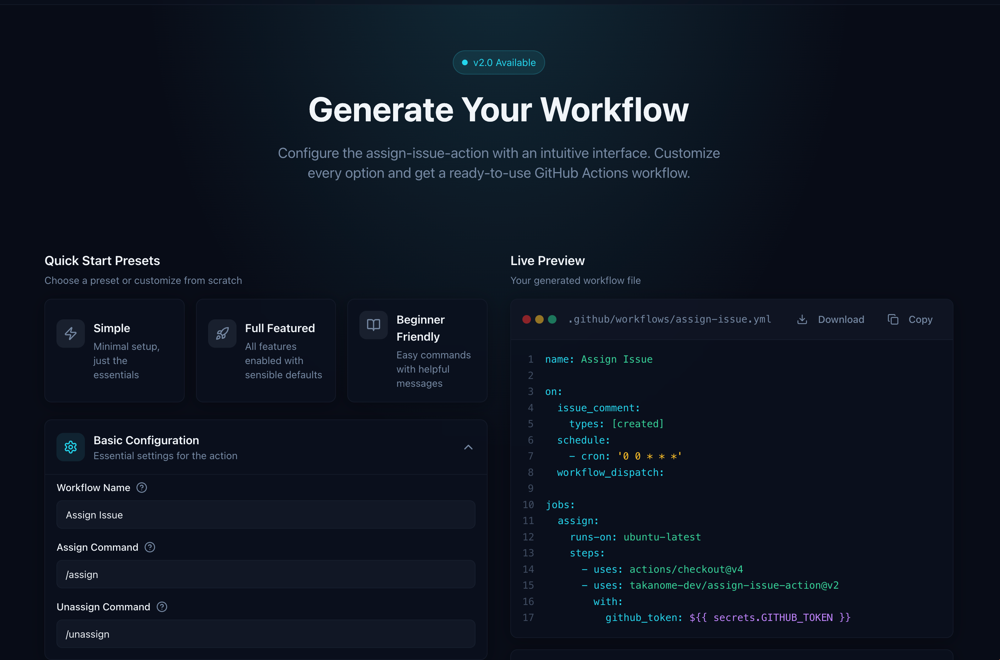

<h2 align="center">💬 Assign Issue Action ✋</h2>

<p align="center">
    <a href="https://github.com/takanome-dev/assign-issue-action">
        
    </a>
    <a href="https://github.com/takanome-dev/assign-issue-action">
        </a>
    <a href="https://github.com/takanome-dev/assign-issue-action">
        
    </a>
    <a href="https://github.com/takanome-dev/assign-issue-action">
        
    </a>
    <a href="https://codecov.io/gh/takanome-dev/assign-issue-action" >
     
     </a>
</p>

<p align="center">
  
</p>

<p align="center">
  <strong>🎯 <a href="https://action.takanomedev.com/">Generate your workflow file online</a></strong>
</p>

---

This action simplifies issue management for maintainers and contributors, making collaboration more efficient.
See the list of [features](#features) below for more details.

## Features

- 📝 Self-assign issues using `/assign-me` command (default)
- 🗑️ Self-unassign from issues using `/unassign-me` command (default)
- 👥 Maintainer-controlled assignments using `/assign @<user>` and `/unassign @<user>` commands
- 🎉 Different welcome messages for first-time contributors vs returning contributors
- ⏰ Automatic unassignment of inactive issues after configurable period (default: 7 days)
- 🛡️ Block self-reassignment after unassignment (requires maintainer approval)
- 🚫 Prevent issue authors from self-assigning their own issues (optional, for roadmap control)
- 🔔 Send reminder notifications before automatic unassignment occurs
- 🔢 Limit the maximum number of issues a user can be assigned to simultaneously (default: 3)
- 🎯 Per-label assignment limits to encourage progression from beginner to advanced issues (e.g., limit "good first issue" to 2 assignments)

## 💻 Usage

Create a workflow (eg: `.github/workflows/assign.yml` learn more about [Creating a Workflow file](https://docs.github.com/en/actions/using-workflows#creating-a-workflow-file)):

```yaml
name: Assign Issue

on:
  schedule:
    - cron: 0 0 * * *
  issue_comment:
    types: [created]
  workflow_dispatch:

jobs:
  assign:
    permissions:
      issues: write
    runs-on: ubuntu-latest
    steps:
      - name: Assign the user or unassign stale assignments
        uses: takanome-dev/assign-issue-action@beta
        with:
          github_token: ${{ secrets.GITHUB_TOKEN }}
          maintainers: '' # list of maintainers with comma separated like 'takanome-dev,octocat'
          # learn more about the inputs below ⬇
```

## Inputs

Various inputs are defined in action.yml to let you configure the action:

| Name                              | Description                                                                                                                                                                                                 | Default                                                                          |
| --------------------------------- | ----------------------------------------------------------------------------------------------------------------------------------------------------------------------------------------------------------- | -------------------------------------------------------------------------------- |
| `github_token`                    | PAT for GitHub API authentication. It's automatically generated when the action is running, so no need to add it into your secrets.                                                                         | `${{ github.token }}`                                                            |
| `self_assign_cmd`                 | The command that assigns the issue to the one who triggered it                                                                                                                                              | `/assign-me`                                                                     |
| `self_unassign_cmd`               | The command that unassigns the issue from the user who triggered it, if they are already assigned.                                                                                                          | `/unassign-me`                                                                   |
| `assign_user_cmd`                 | The command that assigns the user to the issue                                                                                                                                                              | `/assign @<user>`                                                                |
| `unassign_user_cmd`               | The command that unassigns the user from the issue, if they are assigned.                                                                                                                                   | `/unassign @<user>`                                                              |
| `maintainers`                     | A list of maintainers authorized to use `/assign` and `/unassign` commands. List the usernames with comma separated (i.e: 'takanome-dev,octokit'). If not set, the usage of those commands will be ignored. | `''`                                                                             |
| `enable_auto_suggestion`          | A boolean input that controls whether the action should automatically check user comments for phrases signaling interest in issue assignment. Set to true by default.                                       | **`true`**                                                                       |
| `allow_self_assign_author`        | Whether to allow the issue author to self-assign their own issue. Set to `false` to prevent users from creating issues and immediately assigning themselves, giving maintainers control over the roadmap.   | `true`                                                                           |
| `assigned_label`                  | A label that is added to issues when they're assigned, to track which issues were assigned by this action.                                                                                                  | `📍 Assigned`                                                                    |
| `required_label`                  | If set, the issue must have this label to be assigned.                                                                                                                                                      | `''`                                                                             |
| `days_until_unassign`             | The span of time between a user assigning themselves to the issue being unassigned automatically by the action.                                                                                             | `7`                                                                              |
| `pin_label`                       | A label that prevents the user from being unassigned, typically for issues that are expected to take a long time.                                                                                           | `📌 Pinned`                                                                      |
| `assigned_text`                   | The comment posted after a returning contributor (has opened a PR before) has assigned themselves to an issue.                                                                                              | Customizable                                                                     |
| `assigned_newcomer_text`          | The comment posted after a first-time contributor (has never opened a PR) has assigned themselves to an issue. Provides a welcoming message with helpful resources for new contributors.                    | Customizable welcome message                                                     |
| `already_assigned_text`           | The comment posted when a user tries to assign themselves to an issue that is already assigned                                                                                                              | Customizable in the workflow file you're going to create.                        |
| `already_assigned_pinned_text`    | The comment posted when a user tries to assign themselves to a pinned issue that is already assigned                                                                                                        | Customizable message for pinned issues that won't be auto-unassigned.            |
| `unassigned_text`                 | The comment posted after a user is unassigned from an issue (by maintainer or due to inactivity).                                                                                                           | Customizable in the workflow file you're going to create.                        |
| `self_unassigned_text`            | The comment posted after a user unassigns themselves from an issue. If not set, defaults to `unassigned_text`.                                                                                              | Customizable in the workflow file you're going to create.                        |
| `assignment_suggestion_text`      | The comment posted when someone shows interest in being assigned to an issue without using the assignment commands.                                                                                         | Customizable in the workflow file you're going to create.                        |
| `block_assignment`                | Whether to block self-assignment after a user was previously unassigned.                                                                                                                                    | `true`                                                                           |
| `block_assignment_text`           | The comment posted when a user tries to re-assign themselves after being unassigned.                                                                                                                        | Customizable message explaining that a maintainer needs to approve reassignment. |
| `enable_reminder`                 | Whether to send a reminder before automatic unassignment occurs.                                                                                                                                            | `true`                                                                           |
| `reminder_days`                   | How many days after assignment the reminder should be sent. Set to 'auto' to calculate halfway point (days_until_unassign / 2)                                                                              | `auto`                                                                           |
| `reminder_text`                   | The comment posted as a reminder before automatic unassignment.                                                                                                                                             | Customizable message warning about upcoming unassignment.                        |
| `max_assignments`                 | The maximum number of issues a user can be assigned to at once.                                                                                                                                             | `3`                                                                              |
| `max_assignments_text`            | The message posted when a user has reached their maximum assignments.                                                                                                                                       | Customizable message explaining the limit and options for managing assignments.  |
| `max_overall_assignment_labels`   | A comma-separated list of labels that share a per-label assignment limit (e.g., to limit "good first issue" assignments separately from "good second issue").                                               | `good first issue,good second issue`                                             |
| `max_overall_assignment_count`    | The maximum number of issues a user can be assigned for each label in `max_overall_assignment_labels`. Each label has its own independent limit.                                                            | `2`                                                                              |
| `max_overall_assignment_text`     | The message posted when a user has reached the per-label assignment limit.                                                                                                                                  | Customizable message encouraging progression to more advanced issues.            |
| `self_assign_author_blocked_text` | The message posted when an issue author tries to self-assign their own issue but `allow_self_assign_author` is `false`.                                                                                     | Customizable message explaining maintainer approval is needed.                   |
| `ignored_users`                   | A comma-separated list of usernames that are ignored from using `/assign-me`. These users will not be able to self-assign issues.                                                                          | `''`                                                                             |
| `ignored_text`                    | The message posted when an ignored user tries to use `/assign-me`.                                                                                                                                          | Customizable message explaining they cannot self-assign and to contact maintainers. |
| `closed_issue_assignment_text`    | The message posted when a user tries to assign themselves to a closed issue.                                                                                                                                 | Customizable message explaining assignment is only available for open issues.    |

**Note:** The old input names (e.g., `assigned_comment`, `unassigned_comment`, etc.) are still supported for backward compatibility but are deprecated. Please migrate to the new `_text` suffix names. A deprecation warning will be shown in the action logs if you use the old names.

## Outputs

The action provides the following outputs that can be used in subsequent workflow steps:

| Name                | Description                                                                      |
| ------------------- | -------------------------------------------------------------------------------- |
| `assigned`          | Returns 'yes' if an issue was successfully assigned, 'no' otherwise              |
| `unassigned`        | Returns 'yes' if an issue was successfully unassigned, 'no' otherwise            |
| `unassigned_issues` | An array containing the issue numbers that were unassigned during the action run |

## ✏️ Contributing

We would love you to contribute to this project, pull requests are welcome!

## Related Projects

- [vouch](https://github.com/mitchellh/vouch) is a community trust management system with allow list and block list support.

## ⚖️ LICENSE

The scripts and documentation in this project are released under the [MIT License](LICENSE)
